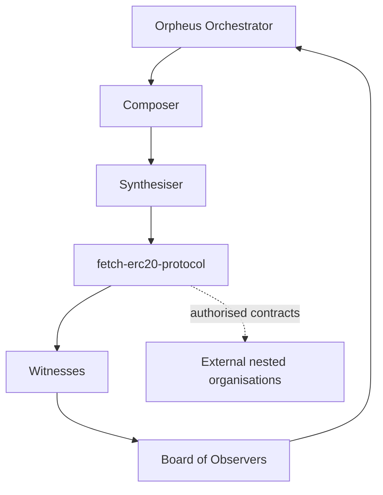

# Fetch ERC20 Protocol Orchestration

## Purpose

Define communication, direction, oversight, and enforcement between `fetch-erc20-protocol`, the Orpheus Orchestrator, Composer, Synthesiser, Witnesses, and any authorised external nested organisations.

## External Communication Rules

- External communication requires explicit bootstrap and tool permission.
- Cross-organisation communication requires a scoped permission contract.
- Witness or observer evidence must be recorded without exposing private runtime state.

## Oversight Flow

## Enforcement

If directions conflict, root Orpheus bootstrap authority and explicit governance decisions take precedence over local app notes. Missing permission evidence is a fail-closed blocker.
