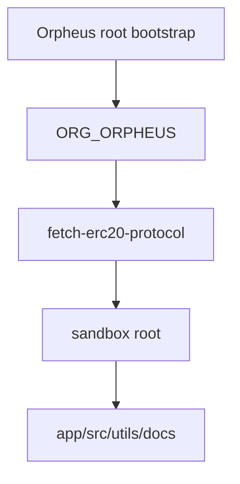

# Fetch ERC20 Protocol Sandbox Architecture

## Purpose

Migrated ERC20 protocol application placeholders from 06_WORKSPACE/00_APPLICATIONS.

## Boundaries

| Surface | Owns | Does Not Own |
| --- | --- | --- |
| `app/` | local entrypoints | core bootstraps |
| `src/` | local implementation | global utilities |
| `utils/` | local helpers | cross-organisation helpers |
| `docs/` | local docs | root policy authority |

## Data Flow

